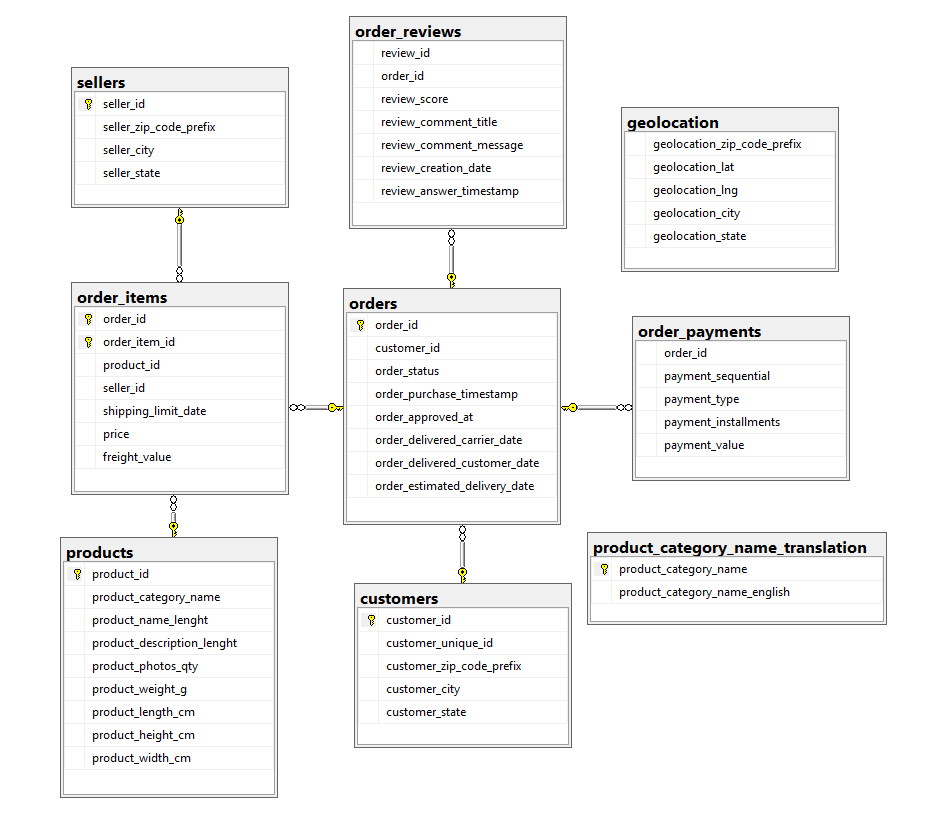
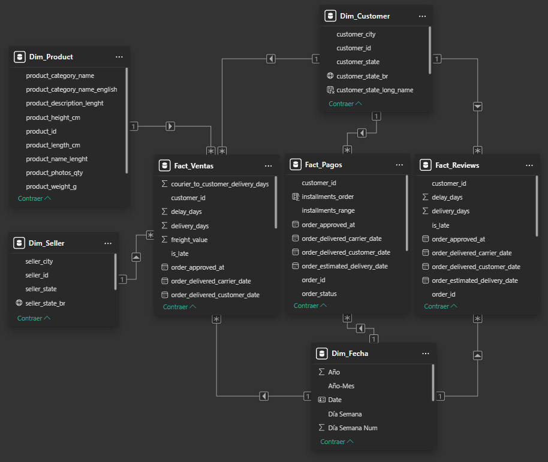
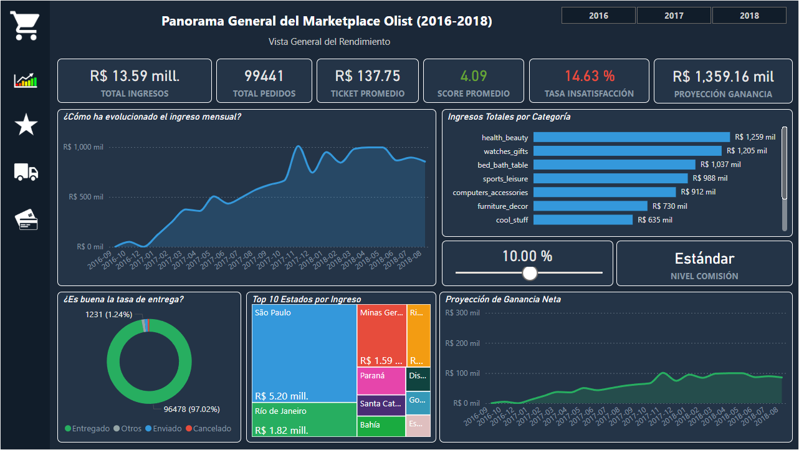
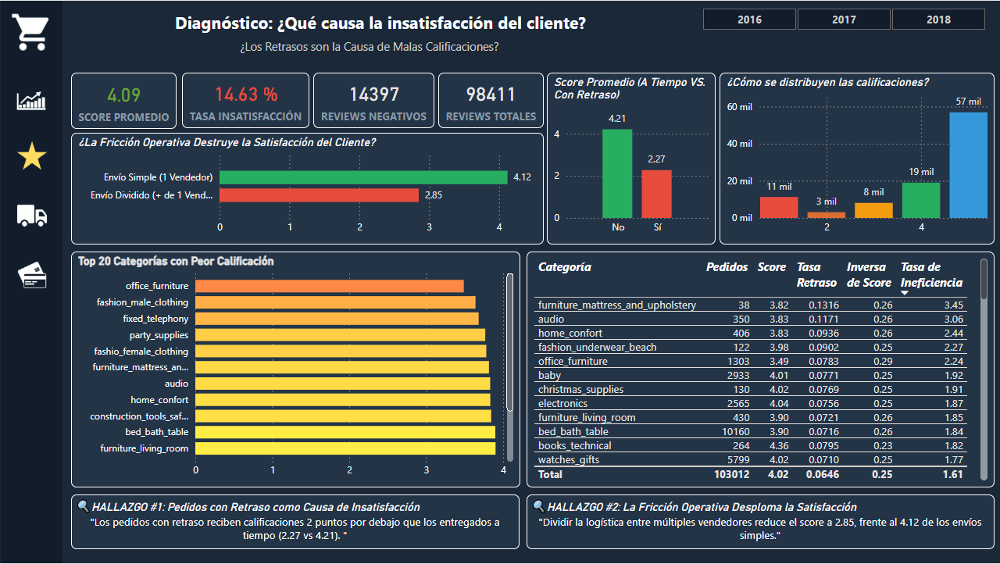
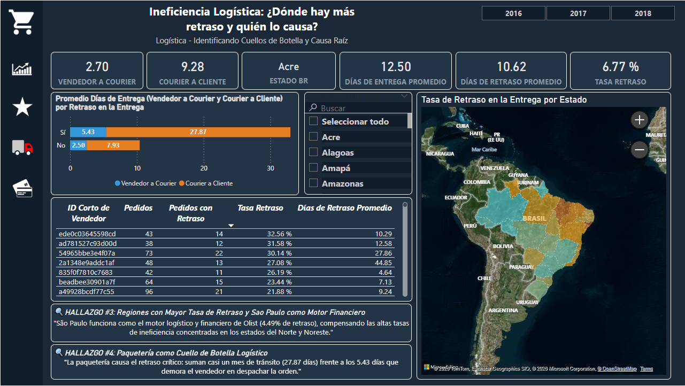
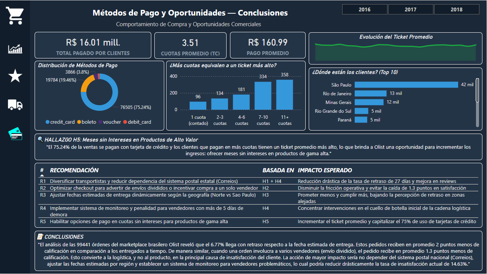
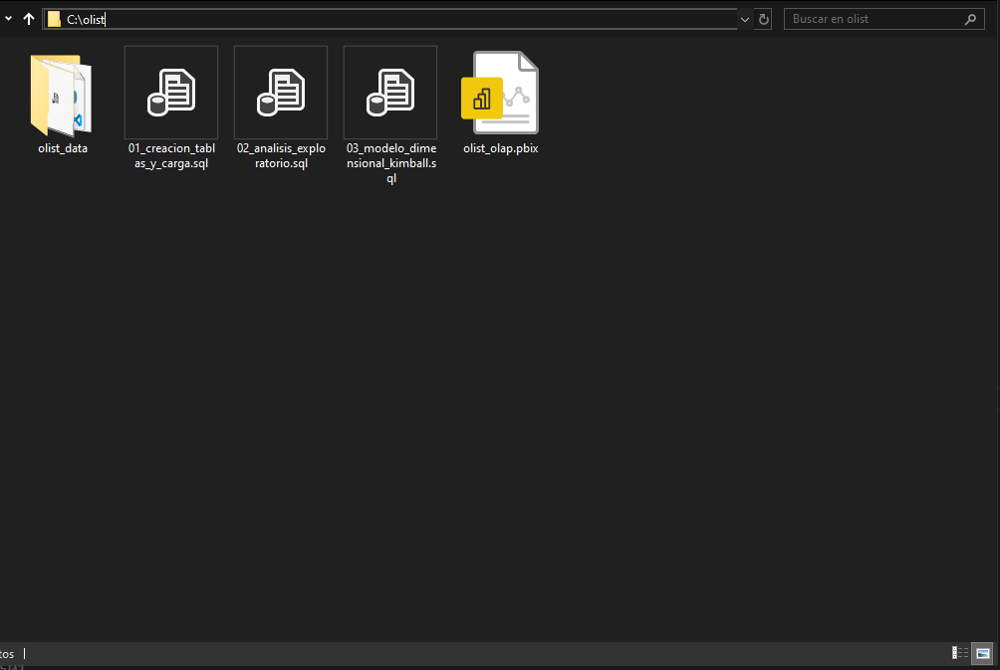

# Análisis End-to-End del Marketplace Olist (Brasil, 2016-2018)

**De datos crudos en CSV y análisis exploratorio de datos en SQL a un dashboard ejecutivo con hallazgos accionables: SQL Server + Power BI + modelo dimensional Kimball.**

> *"El análisis de las 99,441 órdenes del marketplace brasileño Olist reveló que el 6.77% llega con retraso respecto a la fecha estimada de entrega. Estos pedidos reciben en promedio 2 puntos menos de calificación en comparación a los entregados a tiempo. Esto convierte a la logística, y no al producto, en la principal causa de insatisfacción del cliente."*

**[👉 Ver Dashboard Interactivo (Power BI Service)](https://app.powerbi.com/view?r=eyJrIjoiZDcwNjAzZjQtZGQyOC00YmRiLWI0ODQtZmQwMzBkMzM3NTc4IiwidCI6IjQyNzQ2NWNlLWE4MzUtNDc5ZS05ZDBiLWVkZmJmYjhiYzU1OSIsImMiOjR9)**

---

## Tabla de Contenidos

- [Problema de Negocio](#-problema-de-negocio)
- [Dataset](#-dataset)
- [Stack Tecnológico](#️-stack-tecnológico)
- [Proceso del Proyecto](#-proceso-del-proyecto-paso-a-paso)
    - [Fase 1: Carga y Limpieza de Datos](#-fase-1-carga-y-limpieza-de-datos)
    - [Fase 2: Análisis Exploratorio de Datos (EDA)](#-fase-2-análisis-exploratorio-de-datos-eda)
    - [Fase 3: Modelo Dimensional (Kimball)](#-fase-3-modelo-dimensional-kimball)
    - [Fase 4: Dashboard (Power BI)](#-fase-4-dashboard-power-bi)
    - [Fase 5: Hallazgos Clave](#-fase-5-hallazgos-clave)
    - [Fase 6: Recomendaciones de Negocio](#-fase-6-recomendaciones-de-negocio)
- [Queries SQL Destacados](#-queries-sql-destacados)
- [Medidas DAX](#-medidas-dax)
- [Métricas del Proyecto](#-métricas-del-proyecto)
- [Estructura del Repositorio](#-estructura-del-repositorio)
- [Cómo Reproducir](#-cómo-reproducir-este-proyecto)
- [Conclusiones](#-conclusiones)

---

## Problema de Negocio

**Olist** es un marketplace brasileño que conecta pequeños comercios con canales de venta online como Mercado Libre, Amazon Brasil y su propia plataforma. El cliente compra en la plataforma, pero el vendedor se encarga de empaquetar y enviar el producto a través de Correios (el servicio postal estatal de Brasil).

### La pregunta que guió el análisis:

> **¿Cuál es la causa raíz de la insatisfacción del cliente en la plataforma Olist y qué acciones concretas se pueden tomar para reducirla?**

La hipótesis inicial era que la calidad de los productos podría estar generando malas calificaciones. **El análisis demostró lo contrario:** el problema no es el producto, es la logística de entrega.

---

## Dataset

| Atributo | Detalle |
|----------|---------|
| **Fuente** | [Brazilian E-Commerce Public Dataset by Olist (Kaggle)](https://www.kaggle.com/datasets/olistbr/brazilian-ecommerce) |
| **Período** | Septiembre 2016 — Agosto 2018 |
| **Registros totales** | ~650,000+ (sumando todas las tablas), tabla geolocation omitida. |
| **Tablas originales** | 9 tablas relacionales |
| **Pedidos** | 99,441 |
| **Productos únicos** | 32,951 |
| **Vendedores** | 3,095 |
| **Clientes únicos** | 96,096 |

### Modelo Relacional Original (OLTP)



---

## Stack Tecnológico

| Herramienta | Uso |
|-------------|-----|
| **SQL Server (SSMS)** | Almacenamiento, limpieza (DDL/DML), análisis exploratorio (EDA), creación de vistas analíticas, JOINs multiTabla (hasta 5), CTEs, Window Functions (LAG, DENSE_RANK, SUM OVER PARTITION BY), CASE WHEN, subconsultas |
| **Python + Pandas** | Limpieza de CSVs con comas embebidas |
| **Power BI** | Dashboard ejecutivo de 4 páginas con interactividad |
| **DAX** | 30+ medidas (AVERAGEX, CALCULATE, FILTER, VALUES, DIVIDE, VAR/RETURN, TOTALYTD, DATEADD) |
| **Power Query** | Transformaciones, tabla calendario (Dim_Fecha), tipado de columnas |

---

## Proceso del Proyecto (Paso a Paso)

## Fase 1: Carga y Limpieza de Datos

Los archivos CSV de Kaggle presentaron **múltiples problemas de calidad** que tuve que resolver antes de poder analizarlos:

| Problema | Tabla afectada | Solución aplicada |
|----------|---------------|-------------------|
| Comillas dobles embebidas (`"`) en todos los campos VARCHAR | customers, orders, products, sellers, order_items, order_payments | `UPDATE` + `REPLACE` columna por columna |
| Comas dentro del campo `seller_city` que rompían el delimitador de `BULK INSERT` | sellers (filas 553 y 2990) | Corrección manual del CSV (2 registros) |
| Comas embebidas en `geolocation_city` | geolocation (filas 421,040 y 698,308) | Limpieza con **Python + Pandas** (genera CSV limpio) |
| Saltos de línea en `review_comment_message`, textos > 255 caracteres, comas dentro de comentarios | order_reviews | **Flat File Import de SSMS** → tabla temporal (olist_orders_reviews_dataset) → `INSERT INTO` tabla definitiva |
| 2 categorías de producto sin traducción al inglés | products / category_translation | `INSERT INTO` manual: `pc_gamer`, `kitchen_portables_and_food_preparers` |
| 775 órdenes sin información en `order_items` (nunca se pagaron/completaron) | orders ← order_items | Preservadas con `LEFT JOIN` en las vistas analíticas para posterior análisis |

> **Código:** [`sql/01_creacion_tablas_y_carga.sql`](sql/01_creacion_tablas_y_carga.sql)

## Fase 2: Análisis Exploratorio de Datos (EDA)

Con la data limpia, escribí **13 consultas analíticas** que responden preguntas de negocio concretas:

| # | Pregunta de negocio | Técnicas SQL usadas |
|---|---------------------|---------------------|
| 1 | ¿Cuál es la distribución de estados de las órdenes? | `GROUP BY`, `SUM() OVER()` para porcentaje |
| 2 | ¿Cuál es el rango temporal del dataset? | `MIN`, `MAX`, `DATEDIFF` |
| 3 | ¿Cuántos pedidos hay por mes? | `YEAR()`, `MONTH()`, `GROUP BY` |
| 4 | ¿Cuál es el rango de precios y fletes? | Funciones de agregación (`MIN`, `MAX`, `AVG`) |
| 5 | ¿Cómo se distribuyen los métodos de pago? | **CTE** para agregar pagos múltiples por orden, `SUM() OVER()` |
| 6 | ¿Cómo se distribuyen los review scores? | CTE + `ROUND(AVG())` agrupado por orden |
| 7 | ¿Cuáles son las Top 15 categorías por revenue? | **JOIN de 3 tablas** (`order_items` → `products` → `category_translation`) |
| 8 | ¿Cuál es el ingreso mensual de pedidos entregados? | JOIN + filtro por `order_status = 'delivered'` |
| 9 | ¿Qué categorías tienen clientes más insatisfechos? | **JOIN de 5 tablas** + `CASE WHEN` + `HAVING` |
| 10 | ¿Cuáles son los Top 10 estados por clientes? | JOIN de 3 tablas + `COUNT(DISTINCT)` |
| 11 | ¿Cómo se acumula el ingreso a lo largo del año (YTD)? | CTE + **`SUM() OVER(PARTITION BY anio ORDER BY mes)`** |
| 12 | ¿Cuál fue el artículo más caro por cliente? | CTE + **`DENSE_RANK() OVER(PARTITION BY)`** |
| 13 | ¿Cómo varía el ingreso mes a mes (MoM)? | CTE + **`LAG() OVER(ORDER BY)`** + `CASE WHEN` |

> **Código:** [`sql/02_analisis_exploratorio.sql`](sql/02_analisis_exploratorio.sql)

## Fase 3: Modelo Dimensional (Kimball)

### ¿Por qué un modelo estrella con 3 tablas de hechos?

La decisión clave del modelado fue **separar las tablas de hechos por granularidad**. Un JOIN directo entre `order_items`, `order_payments` y `order_reviews` mediante la tabla `orders` generaría un **producto cartesiano**:

```
Ejemplo: Una orden con 3 ítems, 2 pagos y 1 review

❌ JOIN directo: 3 × 2 × 1 = 6 filas (datos inflados)
✅ Separación:   3 + 2 + 1 = 3 fact tables (datos correctos)
```

### Estructura del modelo dimensional



### Detalle de cada tabla

| Vista SQL | Origen | Registros | Granularidad | Columnas calculadas |
|-----------|--------|-----------|-------------|---------------------|
| `analytics.fact_order_items` | orders + order_items | 113,425 | 1 fila por ítem vendido | `delivery_days`, `seller_to_courier_delivery_days`, `courier_to_customer_delivery_days`, `is_late`, `delay_days`, `subtotal` |
| `analytics.fact_order_payments` | orders + order_payments | 103,887 | 1 fila por pago registrado | `purchase_date` (alias) |
| `analytics.fact_order_reviews` | orders + order_reviews + order_items | 99,992 | 1 fila por review emitida | `delivery_days`, `is_late`, `delay_days`, `tipo_logistica` (envío simple vs dividido) |
| `analytics.dim_customer` | customers | 99,441 | 1 fila por customer_id | — |
| `analytics.dim_product` | products + category_translation | 32,951 | 1 fila por producto | `product_category_name_english` (LEFT JOIN) |
| `analytics.dim_seller` | sellers | 3,095 | 1 fila por vendedor | — |

> **Código:** [`sql/03_modelo_dimensional_kimball.sql`](sql/03_modelo_dimensional_kimball.sql)

---

## Fase 4: Dashboard (Power BI)

El dashboard consta de **4 páginas**, cada una con un propósito narrativo que guía al usuario desde el panorama general hasta las conclusiones y recomendaciones.

### Página 1: Panorama General del Marketplace

*Vista ejecutiva del rendimiento de Olist.*



**KPIs principales:**
| Métrica | Valor |
|---------|-------|
| Total Ingresos | R$ 13.59 millones |
| Total Pedidos | 99,441 |
| Ticket Promedio | R$ 137.75 |
| Score Promedio | 4.09 / 5.0 |
| Tasa de Insatisfacción | 14.63% |
| Tasa de Entrega | 97.02% |

**Visualizaciones:** Línea de tendencia de ingresos mensuales, barras horizontales de ingresos por categoría (Top: health_beauty R$ 1,259 mil), treemap de Top 10 estados por ingreso (São Paulo: R$ 5.20 mill), donut de tasa de entrega, slider interactivo de comisión Olist con proyección de ganancia.

---

### Página 2: Diagnóstico — ¿Qué Causa la Insatisfacción?

*Identifica que los retrasos y la fricción operativa son las causas raíz.*



**Hallazgos visualizados:**

| Hallazgo | Dato clave |
|----------|-----------|
| **H1:** Retraso = malas calificaciones | Score con retraso: **2.27** vs a tiempo: **4.21** (−2 puntos) |
| **H2:** Envío dividido destruye la satisfacción | Envío simple: **4.12** vs múltiples vendedores: **2.85** (−1.3 puntos) |

**Visualizaciones:** Gráfico de barras de score (a tiempo vs retraso), distribución de calificaciones (barras agrupadas 1-5 estrellas), barras horizontales de Top 20 categorías con peor calificación, tabla detallada de categorías con pedidos, score, tasa de retraso, inversa de score y tasa de ineficiencia.

---

### Página 3: Ineficiencia Logística — ¿Dónde Hay Retraso y Quién lo Causa?

*Desglosa el proceso de entrega para encontrar el cuello de botella exacto.*



**KPIs de logística:**
| Métrica | Valor |
|---------|-------|
| Vendedor → Courier | 2.70 días |
| Courier → Cliente | 9.28 días |
| Días de Entrega Promedio | 12.50 |
| Días de Retraso Promedio | 10.62 |
| Tasa de Retraso | 6.77% |

**Hallazgos visualizados:**

| Hallazgo | Dato clave |
|----------|-----------|
| **H3:** São Paulo es el motor financiero pero las regiones del Norte y Noreste tienen las peores tasas de retraso | SP: 4.49% retraso vs Maranhão: tasa significativamente mayor |
| **H4:** El cuello de botella es el courier (Correios), no el vendedor | Con retraso → Vendedor: 5.43 días / **Courier: 27.87 días** |

**Visualizaciones:** Barra apilada desglosando días de entrega (vendedor vs courier) por retraso, mapa coroplético de Brasil con tasa de retraso por estado, slicer de estado, tabla "Hall of Shame" de vendedores con mayor tasa de retraso (mínimo 30 pedidos).

---

### Página 4: Métodos de Pago, Oportunidades y Conclusiones

*Identifica oportunidades de revenue y consolida las recomendaciones.*



**KPIs de pagos:**
| Métrica | Valor |
|---------|-------|
| Total Pagado por Clientes | R$ 16.01 millones |
| Cuotas Promedio (TC) | 3.51 |
| Pago Promedio | R$ 160.99 |
| Tarjeta de crédito | 75.24% de las transacciones |

**Hallazgo visualizado:**

| Hallazgo | Dato clave |
|----------|-----------|
| **H5:** Más cuotas = ticket más alto | 1 cuota: R$ 96 → 11+ cuotas: **R$ 358** (3.7x más) |

**Visualizaciones:** Donut de distribución de métodos de pago, barras de ticket promedio por rango de cuotas, evolución de ticket promedio (línea), Top 10 estados por cantidad de clientes, tabla de las 5 recomendaciones con hallazgo base e impacto esperado, bloque de conclusiones.

---

## Fase 5: Hallazgos Clave

### H1: Los Retrasos Son la Causa #1 de Insatisfacción

Los pedidos entregados con retraso reciben calificaciones **2 puntos por debajo** de los entregados a tiempo.

| Tipo de entrega | Score promedio | Diferencia |
|----------------|---------------|------------|
| A tiempo | 4.21 | — |
| Con retraso | 2.27 | **−1.94 puntos** |

### H2: La Fricción Operativa (Envío Dividido) Desploma la Satisfacción

Cuando una orden involucra a múltiples vendedores, el pedido se divide en múltiples envíos. El cliente recibe paquetes separados en fechas distintas, generando confusión e insatisfacción.

| Tipo de logística | Score promedio | Diferencia |
|-------------------|---------------|------------|
| Envío Simple (1 vendedor) | 4.12 | — |
| Envío Dividido (2+ vendedores) | 2.85 | **−1.27 puntos** |

### H3: São Paulo Compensa las Ineficiencias del Norte y Noreste

São Paulo genera R$ 5.20 millones en ingresos con una tasa de retraso relativamente baja (4.49%). Los estados del Norte y Noreste tienen tasas de retraso significativamente más altas por su lejanía de los centros de distribución.

### H4: El Cuello de Botella es Correios (Courier), No el Vendedor

Al desglosar los días de entrega en dos etapas (vendedor → courier y courier → cliente), se descubre que:

| Etapa | Sin retraso | Con retraso | Diferencia |
|-------|------------|------------|------------|
| Vendedor → Courier | 2.50 días | 5.43 días | +2.93 días |
| Courier → Cliente | 7.93 días | **27.87 días** | **+19.94 días** |

**Conclusión:** El courier (Correios) es responsable del **84% del tiempo de retraso** (27.87 de 33.30 días totales).

### H5: Más Cuotas = Ticket Promedio Más Alto

El 75.24% de las ventas se pagan con tarjeta de crédito. Existe una correlación directa entre la cantidad de cuotas y el valor de la compra:

| Cuotas | Ticket promedio | Multiplicador |
|--------|----------------|---------------|
| 1 (contado) | R$ 96 | 1.0x |
| 2-3 cuotas | R$ 134 | 1.4x |
| 4-6 cuotas | R$ 181 | 1.9x |
| 7-10 cuotas | R$ 334 | 3.5x |
| 11+ cuotas | R$ 358 | **3.7x** |

**Oportunidad:** Promover meses sin intereses en productos de gama alta incrementaría el ticket promedio y aprovecharía el uso masivo de tarjetas de crédito.

---

## Fase 6: Recomendaciones de Negocio

| # | Recomendación | Basada en | Impacto esperado |
|---|---------------|-----------|------------------|
| R1 | **Diversificar transportistas** y reducir dependencia de Correios | H1 + H4 | Reducción drástica de la tasa de retraso de 27 días y mejora en reviews |
| R2 | **Optimizar checkout:** advertir sobre envíos divididos o incentivar compra a un solo vendedor | H2 | Disminuir la fricción operativa y evitar la caída de 1.3 puntos en satisfacción |
| R3 | **Ajustar fechas estimadas de entrega** según la geografía (Norte vs São Paulo) | H3 | Prometer menos y cumplir más, bajando la percepción de retraso en zonas alejadas |
| R4 | **Sistema de monitoreo y penalidad** para vendedores con más de 5 días de demora | H4 | Concentrar intervenciones en el cuello de botella inicial de la cadena logística |
| R5 | **Habilitar cuotas sin intereses** en productos de gama alta | H5 | Incrementar el ticket promedio y capitalizar el 75% de uso de tarjetas de crédito |

---

## Queries SQL Destacados

### Crecimiento porcentual mes a mes (Window Function: `LAG`)

```sql
WITH ingresos_mensuales AS (
    SELECT
        YEAR(o.order_purchase_timestamp) AS anio,
        MONTH(o.order_purchase_timestamp) AS mes,
        SUM(oi.price + oi.freight_value) AS ingreso
    FROM orders o
    INNER JOIN order_items oi ON o.order_id = oi.order_id
    GROUP BY YEAR(o.order_purchase_timestamp), MONTH(o.order_purchase_timestamp)
)
SELECT
    anio,
    mes,
    ingreso,
    CAST(
        (ingreso - LAG(ingreso) OVER(ORDER BY anio, mes)) * 100.0
        / LAG(ingreso) OVER(ORDER BY anio, mes)
    AS DECIMAL(12,2)) AS variacion_porcentual,
    CASE
        WHEN ingreso - LAG(ingreso) OVER(ORDER BY anio, mes) > 0 THEN 'incremento'
        WHEN ingreso - LAG(ingreso) OVER(ORDER BY anio, mes) < 0 THEN 'decremento'
    END AS tendencia
FROM ingresos_mensuales
ORDER BY anio, mes;
```

### Causa raíz del retraso: Vendedor vs Courier (CTE + GROUP BY)

```sql
WITH delivery_days_table AS (
    SELECT
        order_id,
        MAX(seller_to_courier_delivery_days) AS seller_to_courier,
        MAX(courier_to_customer_delivery_days) AS courier_to_customer,
        MAX(is_late) AS is_late
    FROM analytics.fact_order_items
    WHERE order_status = 'delivered'
    GROUP BY order_id
)
SELECT
    is_late,
    CAST(AVG(seller_to_courier * 1.00) AS DECIMAL(5,2)) AS avg_seller_to_courier,
    CAST(AVG(courier_to_customer * 1.00) AS DECIMAL(5,2)) AS avg_courier_to_customer
FROM delivery_days_table
GROUP BY is_late;
```

### Vista Fact_Reviews con clasificación de tipo de logística (CTE dentro de VIEW)

```sql
CREATE OR ALTER VIEW analytics.fact_order_reviews AS
WITH sellers_por_orden AS (
    SELECT order_id, COUNT(DISTINCT seller_id) AS cantidad_vendedores
    FROM order_items
    GROUP BY order_id
)
SELECT
    r.review_id, o.order_id, o.customer_id, r.review_score,
    DATEDIFF(DAY, o.order_purchase_timestamp, o.order_delivered_customer_date) AS delivery_days,
    CASE
        WHEN CAST(o.order_delivered_customer_date AS DATE) > CAST(o.order_estimated_delivery_date AS DATE) 
        THEN 'Sí' ELSE 'No'
    END AS is_late,
    CASE
        WHEN s.cantidad_vendedores = 1 THEN 'Envío Simple (1 Vendedor)'
        WHEN s.cantidad_vendedores > 1 THEN 'Envío Dividido (+ de 1 Vendedor)'
        ELSE 'Sin Vendedor / Cancelado'
    END AS tipo_logistica
FROM orders o
LEFT JOIN order_reviews r ON o.order_id = r.order_id
LEFT JOIN sellers_por_orden s ON o.order_id = s.order_id;
```

---

## Medidas DAX

Se crearon **40+ medidas DAX** organizadas en 5 categorías:

### Medidas de Satisfacción (ejemplo)

```dax
// Score calculado a nivel de orden para evitar sesgo por órdenes con múltiples reviews
Score Promedio por Orden = 
    AVERAGEX(
        VALUES(Fact_Reviews[order_id]),
        CALCULATE(AVERAGE(Fact_Reviews[review_score]))
    )
```

### Medidas Logísticas (ejemplo)

```dax
// Tasa calculada sobre pedidos con fecha de entrega (excluye cancelados/en tránsito)
Tasa Retraso = 
    VAR _entregados =
        CALCULATE(
            DISTINCTCOUNT(Fact_Ventas[order_id]),
            NOT(ISBLANK(Fact_Ventas[delivery_days]))
        )
    RETURN
        DIVIDE([Pedidos con Retraso], _entregados, 0) * 100
```

### Medidas de Pagos (ejemplo)

```dax
// Promedio ponderado de cuotas (por monto) para tarjetas de crédito
Cuotas Promedio = 
    CALCULATE(
        AVERAGEX(
            VALUES(Fact_Pagos[order_id]),
            CALCULATE(
                DIVIDE(
                    SUMX(Fact_Pagos, Fact_Pagos[payment_installments] * Fact_Pagos[payment_value]),
                    SUM(Fact_Pagos[payment_value]), 0
                )
            )
        ),
        Fact_Pagos[payment_type] = "credit_card"
    )
```

### Medidas de Inteligencia de Tiempo (ejemplo)

```dax
Crecimiento MoM = 
    VAR _actual = [Total Ingresos]
    VAR _anterior = CALCULATE([Total Ingresos], DATEADD(Dim_Fecha[Date], -1, MONTH))
    RETURN DIVIDE(_actual - _anterior, _anterior, 0)

Ingreso Acumulado YTD = 
    TOTALYTD([Total Ingresos], Dim_Fecha[Date])
```

---

## Métricas del Proyecto

### Lo que construí:

| Categoría | Cantidad |
|-----------|----------|
| Tablas creadas (DDL) | 9 |
| Registros procesados en total | ~650,000+ |
| Consultas analíticas (EDA) | 13 |
| Vistas SQL (esquema analytics) | 6 |
| Medidas DAX | 40+ |
| Páginas del dashboard | 4 |
| Hallazgos documentados | 5 |
| Recomendaciones de negocio | 5 |
| Problemas de calidad de datos resueltos | 5 tipos distintos |

### Técnicas SQL demostradas:

| Categoría | Técnicas |
|-----------|----------|
| **Joins** | INNER, LEFT, RIGHT, FULL OUTER JOIN (entre 2-5 tablas) |
| **Agregación** | GROUP BY, HAVING, funciones de agregación (SUM, AVG, COUNT, MIN, MAX) |
| **Window Functions** | `ROW_NUMBER()`, `DENSE_RANK()`, `LAG()`, `SUM() OVER(PARTITION BY... ORDER BY...)`, `COUNT() OVER()` |
| **CTEs** | Simples y anidadas (hasta 3 niveles) |
| **Subconsultas** | En cláusula `WHERE... IN (SELECT...)` |
| **Condicionales** | `CASE WHEN `|
| **DDL** | `CREATE DATABASE`, `CREATE TABLE`, `CREATE SCHEMA`, `CREATE OR ALTER VIEW` |
| **DML** | `BULK INSERT`, `INSERT INTO... SELECT`, `UPDATE... SET` |
| **Funciones** | `DATEDIFF`, `CAST`, `REPLACE`, `YEAR`, `MONTH`, `GREATEST` |

---

## Estructura del Repositorio

```
olist-ecommerce-analisis/
│
├── README.md                              
│
├── sql/
│   ├── 01_creacion_tablas_y_carga.sql     
│   ├── 02_analisis_exploratorio.sql       
│   └── 03_modelo_dimensional_kimball.sql  
│                  
├── dashboard/
│   ├── olist_olap.pbix               
│   └── olist_dashboard.pdf                
│
├── images/
│   ├── 01_general.png            
│   ├── 02_satisfaccion.png    
│   ├── 03_logistica.png      
│   └── 04_pagos_recomendaciones_conclusiones.png         
│
├── python/
│   └── limpieza_geolocation.ipynb
|
└── data/
    └── README.md                          
```

---

## Cómo Reproducir Este Proyecto

> **⚠️ Recomendación de Configuración para Replicar el Proyecto:** > Para ejecutar este proyecto localmente sin errores de conexión, asegúrate de que el repositorio esté ubicado en la raíz de tu disco. La ruta de trabajo principal debe ser exactamente `C:\olist` (es decir, debes renombrar la carpeta principal de `olist-ecommerce-analisis` a simplemente `olist`) y replicar la **estructura de carpetas**.

### Estructura de Carpetas Local



### Requisitos previos
- SQL Server 2019+ y SQL Server Management Studio (SSMS)
- Power BI Desktop
- Dataset descargado de [Kaggle](https://www.kaggle.com/datasets/olistbr/brazilian-ecommerce)

### Pasos

1. **Descargar el dataset** desde Kaggle y extraer los CSVs en una carpeta local (ej. `C:\olist\olist_data\`)
2. **Ejecutar** `sql/01_creacion_tablas_y_carga.sql` en SSMS para crear la base de datos, tablas, cargar datos y limpiarlos
3. **Ejecutar** `sql/02_analisis_exploratorio.sql` para las consultas analíticas (opcional, el dashboard ya tiene todo)
4. **Ejecutar** `sql/03_modelo_dimensional_kimball.sql` para crear las vistas analíticas que Power BI consumirá
5. **Abrir** `dashboard/olist_olap.pbix` en Power BI Desktop
6. **Configurar la conexión** a tu instancia de SQL Server local (Get Data → SQL Server → `localhost` → `OlistEcommerce`)

> **Nota:** Las rutas de los archivos CSV en los `BULK INSERT` deben ajustarse a la ubicación donde descargaste el dataset.

---

## Conclusiones

El análisis de las 99,441 órdenes del marketplace brasileño Olist reveló que el **6.77% llega con retraso** respecto a la fecha estimada de entrega. Estos pedidos reciben en promedio **2 puntos menos** de calificación en comparación a los entregados a tiempo. De manera similar, cuando una orden involucra a varios vendedores (envío dividido), el pedido recibe en promedio **1.3 puntos menos** de calificación.

Esto convierte a **la logística, y no al producto, en la principal causa de insatisfacción del cliente**. La acción de mayor impacto sería no depender del sistema postal nacional (Correios), ajustar las fechas estimadas por región y establecer un sistema de monitoreo para vendedores problemáticos, lo cual podría reducir drásticamente la tasa de insatisfacción actual del **14.63%**.

---

*Proyecto desarrollado como parte de mi portafolio de análisis de datos.*  
*Herramientas: SQL Server (SSMS) · Power BI (DAX, Power Query) · Python (Pandas)*
